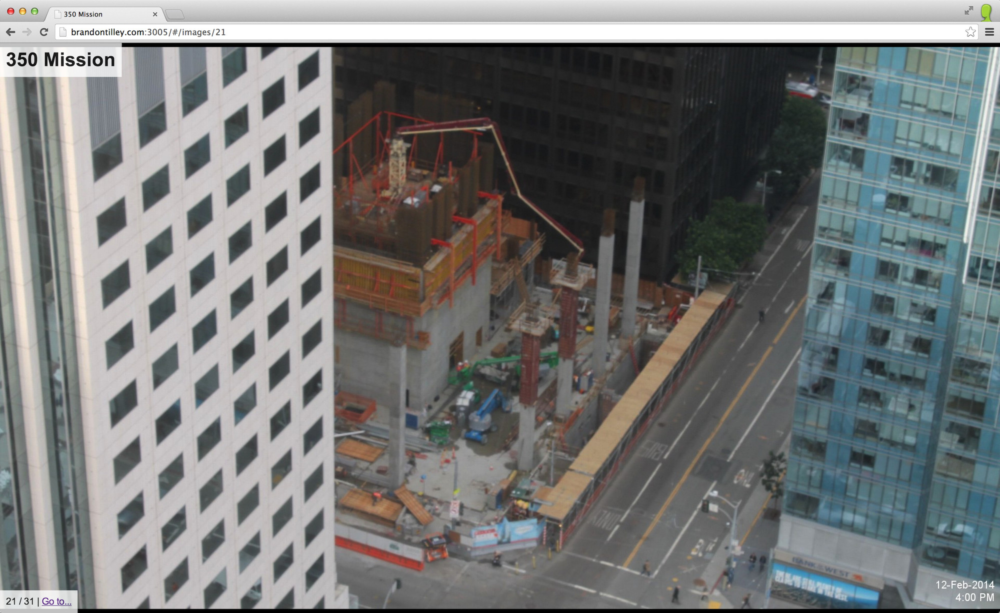

350 Mission Webcam Watcher
==========================

There is an awesome webcam pointed at the new building going up at 350 Mission in San Francisco. Unfortunately, the archives are not available, only individual shots. So, this Node application polls for changes, storing them off in a LevelDB database, and presents a web interface for viewing the images.



Installation
------------

Requires [Node.js](http://nodejs.org/).

```
$ npm install
$ npm start
```

You may pass a `PORT` environment variable if you'd like the web server to start on a port other than 8133.

The app will poll the webcam image URL every two minutes. The webcam appears to only take new pictures during the day.
